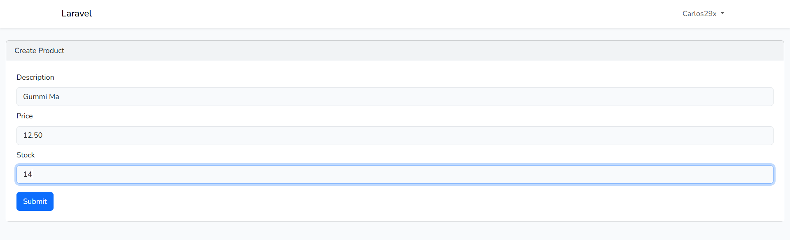
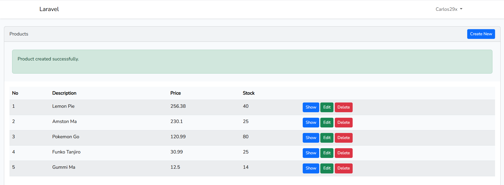

<p align="center"><a href="https://laravel.com" target="_blank"></a></p>

<p align="center">
<a href="https://github.com/laravel/framework/actions"></a>
<a href="https://packagist.org/packages/laravel/framework"></a>
<a href="https://packagist.org/packages/laravel/framework"></a>
<a href="https://packagist.org/packages/laravel/framework"></a>
</p>

# Universidad Tecnológica de Panamá

# Facultad de Ingeniería de Sistemas Computacionales

## Fecha de Ejecución:

23 de Abril de 2026

## Objetivos

- Implementar un Sistema CRUD en Laravel para la Gestión de Datos.  

- Aplicar la arquitectura MVC en el desarrollo del proyecto.  

- Utilizar herramientas de Laravel para generar Modelos, Migraciones y Controladores.  

## Introducción

## 📖 Introducción

Laravel es un framework de desarrollo web basado en PHP que permite crear aplicaciones modernas utilizando la arquitectura MVC, facilitando la organización del código.

En este laboratorio se desarrolló un sistema CRUD para la gestión de datos, aplicando el patrón Modelo-Vista-Controlador (MVC). Durante el proceso se configuró el entorno de trabajo, se instalaron dependencias y se implementaron operaciones para crear, actualizar y eliminar registros.

## ⚙️ Requisitos Previos

Para la ejecución del laboratorio se requiere contar con el siguiente ecosistema de desarrollo:

### Tecnologías utilizadas

- 🐘 PHP 8.0 o superior  
- 📦 Composer (última versión estable)  
- ⚙️ Laravel (framework PHP)  
- 🌐 Servidor web: Apache   
- 🛢️ Base de datos MySQL  
- 💻 Entorno de desarrollo local: XAMPP / WampServer 
- 📝 Editor de código: Visual Studio Code  
- 🟢 Node.js y NPM (para manejo de dependencias frontend)  

### 🖥️ Sistema Operativo

- Windows 10 / 11  

## 🔧 Instalación y configuración del proyecto

A continuación, se describe el proceso completo para instalar y ejecutar el proyecto Laravel desde cero. Estos pasos permiten que cualquier usuario pueda clonar el repositorio y poner en funcionamiento la aplicación correctamente.

---

### 1. Clonar o crear el proyecto

Si el proyecto ya está en un repositorio, se debe clonar:

```bash
git clone URL_DEL_REPOSITORIO
cd login-app
```

Si se crea desde cero:

```bash
laravel new login-app
```

---

### 2. Instalación de dependencias (Composer)

```bash
composer install
```

```bash
npm install
```

```bash
npm run dev
```

Estos comandos instalan las dependencias necesarias del proyecto. "composer install" descarga las librerías del backend definidas en composer.json en la carpeta vendor/. "npm install2 instala las dependencias del frontend, y "npm run dev" compila los archivos CSS y JavaScript para su correcto funcionamiento.

---

### 3. Configuración del archivo `.env`

Laravel utiliza un archivo `.env` para manejar variables de entorno.

Primero, se debe crear copiando el archivo de ejemplo:

```bash
cp .env.example .env
```

Luego se configura la base de datos:

```env
DB_DATABASE=crud_rapido
DB_USERNAME=root
DB_PASSWORD=kamado29
```
En mi caso, tiene contraseña 

Este paso es fundamental, ya que permite la conexión entre Laravel y la base de datos.

---

## 🛠️ Comandos utilizados

### 1. Limpieza de configuración

```bash
php artisan config:clear  
php artisan cache:clear  
php artisan config:cache 
``` 

Estos comandos permiten limpiar y actualizar la configuración del proyecto para asegurar que los cambios sean aplicados correctamente.

---

### 2. Creación del modelo y migración

```bash
php artisan make:model Product -m  
```

Crea el modelo `Product` junto con una migración para la tabla `products`.

---

### 3. Ejecución de migraciones

```bash
php artisan migrate  
```

Ejecuta las migraciones y crea las tablas en la base de datos.

```bash
php artisan migrate:fresh  
```

Elimina todas las tablas y las vuelve a crear desde cero.

---

### 4. Generación del CRUD

```bash
composer require ibex/crud-generator --dev  
php artisan vendor:publish --tag=crud  
php artisan make:crud products  
```

Permite generar automáticamente los componentes del CRUD como modelos, controladores, vistas y rutas.

---

### 5. Implementación de interfaz (Laravel UI)

```bash
composer require laravel/ui --dev  
php artisan ui bootstrap  
```

Instala las herramientas de interfaz de Laravel para generar vistas básicas con Bootstrap.

---

### 6. Actualización de autoload

```bash
composer dump-autoload  
```

Actualiza el cargador de clases de Composer para reconocer nuevos archivos.

---

### 6. Ejecución del servidor

```bash
php artisan serve  
```

Inicia el servidor de desarrollo.

La aplicación estará disponible en: 

http://127.0.0.1:8000/  --Login

http://127.0.0.1:8000/products  -- Crud Generado


## 🖼️ Resultados

### Registro


### CRUD


## 📚 Referencias

A continuación, algunas de las fuentes consultadas para el desarrollo del laboratorio:

Laravel. (2026). Documentación oficial de Laravel. https://laravel.com/docs

Informática DP. (2022, January 20). CRUD RÁPIDO - LARAVEL [Video]. YouTube. https://www.youtube.com/watch?v=j5baJsM_Adc 

## 👤 Información del Estudiante

Este laboratorio ha sido desarrollado por el estudiante de la Universidad Tecnológica de Panamá:

Nombre: Carlos Concepción

Correo: carlos.concepcion2@utp.ac.pa

Curso: Desarrollo de Software VII

Instructor: Irina Fong


